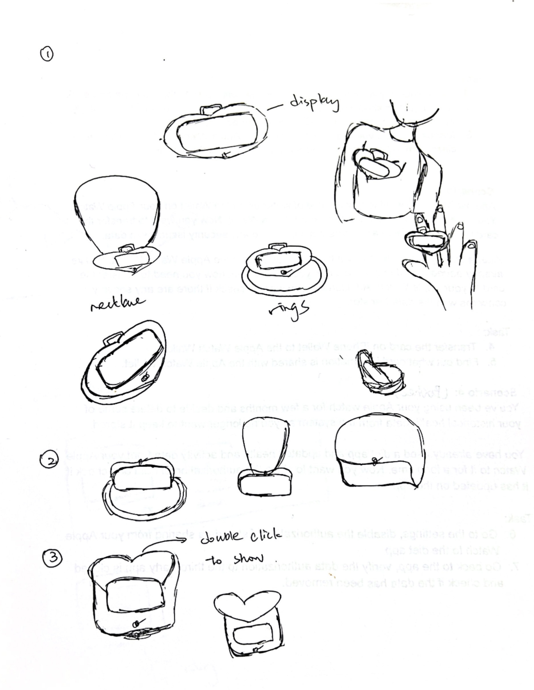
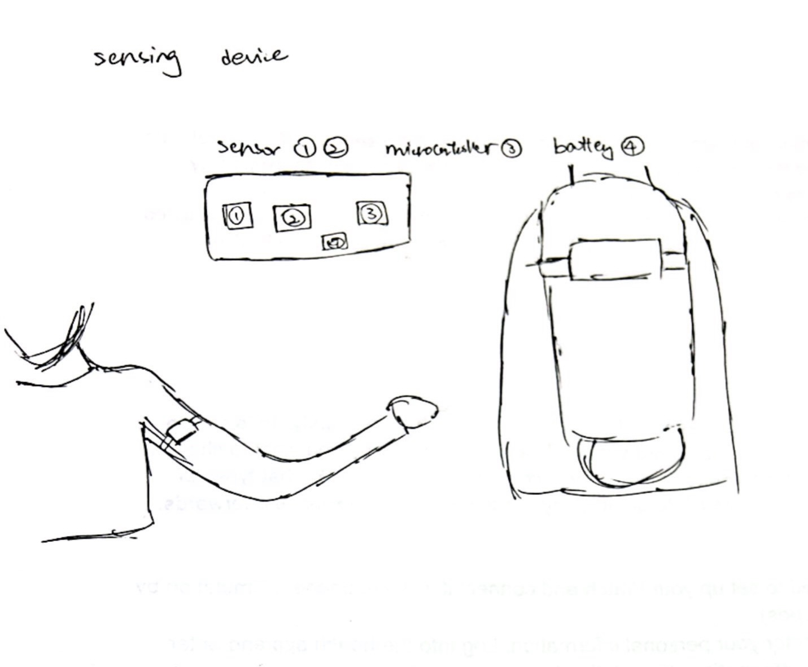
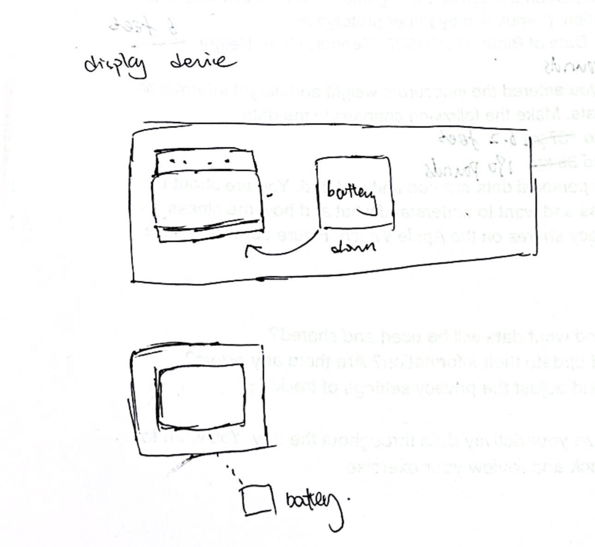

# System Architecture with Diagram (HW+SW)

#### TECHIN514 Yishuai Zheng

## Introduction
This project aims to use multiple sensors to track the situation of pancreatitis and prevent future occurrence. I chose MAX30100, Hamamatsu G11193-10R, and a OLED screen display to measure the heart rate, blood sugar, pulse oximetry, and finally display on the screen to notify users.

## Sensing Device
• Hamamatsu G11193-10R: have spectral response detected to measure blood sugar. 
•   MAX30100: Heart rate sensor, track the heart rate which may reflect the signals of pain, warn users if there are unusual heart rate patterns

Technical details:
•   Connection: Wireless through Bluetooth or Wi-Fi
•  Power: Lithium Polymer, 3.7V, 1000mAh, high energy, rechargeable, small pack, 12-24 hrs, able to work for multiple sensors with wireless connection
•   Microcontroller: Arduino / ESP-32 / Seeed Studio XIAO
•   Processing: collect data (blood sugar, heart rate, and pulse oximetry from the sensors, process and generate real time results. Specifically process the blood sugar values. Filter the results from sensors and set thresholds to process signals.

## Display Device
Display device: I aim to use a stepper-motor-driven gauge needle, a display screen, and a LED to track and display abnormal activities to alert users.
•   A stepper-motor-driven gauge needle to indicate when there is abnormal activity in changes of blood sugar / heart rate / pressure levels
•   Additional warning signs by LED when unusual activities occur in order to alert user
•   An OLED or E-link display to alert users by show warning signs, continuously showing the synthesized health values
•   Other than the abnormal activities detected from sensors, display the trend of values before and after meals
 
Technical details:
•   Connection: Wireless through Bluetooth or Wi-Fi
•  Power: Lithium-Ion or Lithium Polymer Battery, 3.7V typically, 1000-2000 mAh to support signals from stepper-motor-driven gauge needle, LED, and display
•   Microcontroller: Arduino / ESP-32 / Seeed Studio XIAO
•   Processing: Based on the signals, display the output and alert users by LED, stepper-motor-driven gauge needle, and screen when the real time values exceed the preset thresholds.

## Connection & Communication Diagram

